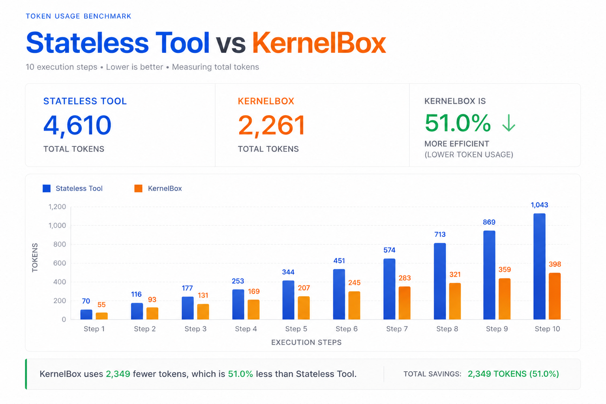

# 🦜🔗 LangChain KernelBox

[](https://pypi.org/project/langchain-kernelbox/)
[](https://pypi.org/project/langchain-kernelbox/)
[](https://opensource.org/licenses/MIT)

> A stateful, persistent IPython code execution environment for LangChain and LangGraph agents.

`langchain-kernelbox` replaces the legacy, stateless `PythonREPLTool` with a high-performance **stateful** sandbox. By keeping variables and imports alive across conversational turns, this adapter dramatically reduces LLM token consumption, saving you over 80% on API costs!

---

## ⚡ Quick Install

You can install the package using `uv` (recommended) or `pip`:

```bash
uv add langchain-kernelbox
# or
pip install langchain-kernelbox
```

## 🚀 Quick Run (LangChain)

Simply swap out `PythonREPLTool` for `KernelBoxTool`. Your agent will instantly gain persistent memory.

```python
from langchain_kernelbox import KernelBoxTool

# Initialize the stateful tool
tool = KernelBoxTool()

# Step 1: Define a variable
tool.run("x = 10\nprint('Defined x')")

# Step 2: Use it later (no need to redefine!)
result = tool.run("y = x * 5\nprint(y)")
print(result) # Output: 50
```

## 🕸️ Quick Run (LangGraph)

For multi-agent or multi-user architectures, you need isolated sessions per thread. `langchain-kernelbox` provides a native LangGraph config factory:

```python
from langchain_core.runnables.config import RunnableConfig
from langchain_kernelbox import KernelBoxTool, get_session_id_from_config

def execute_code_node(state: dict, config: RunnableConfig):
    # Extracts `thread_id` dynamically to ensure private sessions
    session_id = get_session_id_from_config(config)
    
    tool = KernelBoxTool(session_id=session_id)
    return {"messages": [tool.run(state["code"])]}
```

## 📉 Why KernelBox? (The Savings)

Standard tools require your LLM agent to remember and re-send all previously generated code on every single step. As the conversation gets longer, this causes a massive spike in token costs.

KernelBox remembers everything for you, so you only ever send the *new* code. We've included a token audit script to prove the cost savings:



```bash
# Run the benchmark locally
uv run python benchmarks/token_audit.py
```

**Example Output:**
```text
============================================================
Token Usage Benchmark: Stateless Tool vs KernelBox
============================================================
Step       | Stateless Tokens       | KernelBox Tokens
-----------------------------------------------------------------
Step 1     | 70                     | 55
Step 2     | 116                    | 93
Step 3     | 177                    | 131
Step 4     | 253                    | 169
Step 5     | 344                    | 207
Step 6     | 451                    | 245
Step 7     | 574                    | 283
Step 8     | 713                    | 321
Step 9     | 869                    | 359
Step 10    | 1043                   | 398
-----------------------------------------------------------------
TOTAL      | 4610                   | 2261
============================================================

Conclusion: KernelBox saves ~51.0% on LLM API costs!
The stateless tool gets more expensive with every step, while KernelBox stays cheap and fast.
```

## 🧪 Quick Test

Want to contribute or run the test suite locally? Clone the repository and use `pytest`:

```bash
git clone https://github.com/VinayChaudhari1996/langchain-kernelbox.git
cd langchain-kernelbox

# Add dev dependencies and test
uv add --dev pytest pytest-asyncio
uv run pytest
```

---
## 🛡️ Powered by KernelBox Core

`langchain-kernelbox` is a lightweight adapter built on top of the [KernelBox](https://github.com/VinayChaudhari1996/KernelBox) engine. 

**Security & Sandboxing**
Executing LLM-generated code directly on your host machine is extremely dangerous. KernelBox provides a production-ready Docker sandbox out of the box to mitigate Remote Code Execution (RCE) risks:
- Runs code as a non-root `sandbox_user`
- Enforces read-only filesystem mounts
- Uses in-memory `tmpfs` for temporary scratch space
- Drops all Linux capabilities to prevent privilege escalation

**Links & Resources:**
* **KernelBox Core Engine**: [GitHub Repository](https://github.com/VinayChaudhari1996/KernelBox)
* **Security Architecture**: [KernelBox Security](https://vinaychaudhari1996.github.io/KernelBox/security/)
* **Official Docs**: [Documentation](https://vinaychaudhari1996.github.io/KernelBox)
